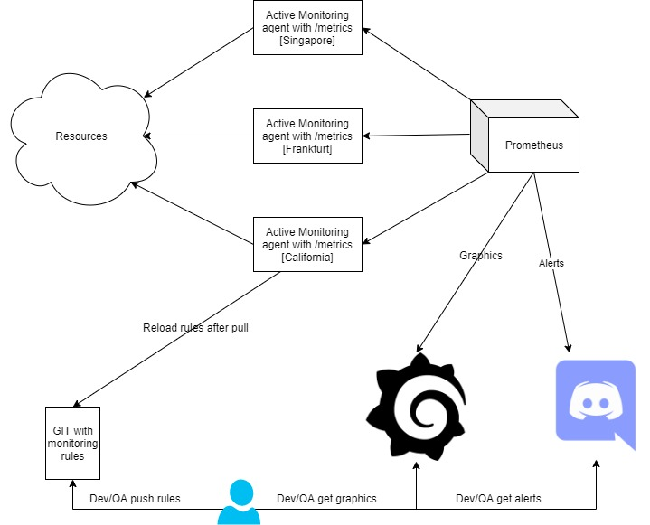

# External monitoring system
## Conception
  
1. Developers/QA/Devops/etc describe rules with items for monitoring and push them to git
2. Monitoring agents(em-agent) make a `git pull` periodically(for example by cron), if there are any changes - restart em-agent
3. em-agent outcome could be found at /metrics endpoint
4. Prometheus has to take data from em-agents
5. Create graphics in grafana
6. Write triggers and push alerts to messangers(discord/telegram/slack/etc)
7. Developers/QA/Devops/etc can get results as graphics and alerts

[github](https://github.com/alter/em-agent)  

## Rules examples
Look up for examples in a *checks* folder  

# Installation
## Requirements
Python >=3.5  
`sudo apt-get install libssl-dev libcurl4-openssl-dev python3-dev`  
`pip install -r requirements.txt` 

## Configure
Check config.py, you can put any yaml files in config.CHECKS_FOLDER  

# Usage
## Put checks in yaml format
You can set not all options, in that case default values will be used  
It's possible to make GET and POST checks at this moment  
```yaml
web_checks:
  - name: zabbix
    url: zabbix.wvservices.com
    scheme: https
    method: get
    timeout: 5s
    update_interval: 15s
    return_http_code: 304
  - name: waves.exchange
    url: waves.exchange
    scheme: https
    method: get
    timeout: 10s
    update_interval: 30s
  - name: postman post
    url: postman-echo.com/post
    scheme: https
    method: post
    timeout: 15s
    postfields: text=super&pass=oops&user=lamer
```

### Default values
```yaml
name: unreal-ip
url: 256.256.256.256
scheme: https
method: get
request_timeout: 15
connection_timeout: 3
update_interval: 60
return_http_code: 200
arguments:
postfields:
```

### How to run application
Launch `./agent.py`  
Check [http://127.0.0.1:8000/metrics](http://127.0.0.1:8000/metrics)  

example:  
```yaml
web_em_check{label="localhost"} 1
web_em_check{label="waves.exchange"} 1
web_em_check{label="zabbix"} 0
web_em_check{label="postman post"} 1
web_em_check{label="web3tech.ru"} 1

```

## Apply changes
Restart application for using new checks  
